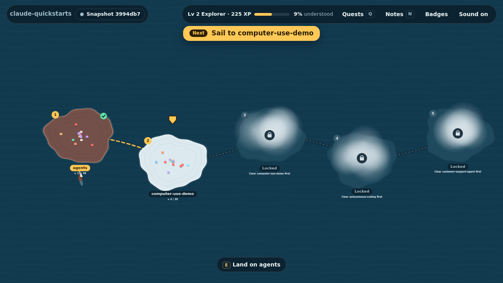
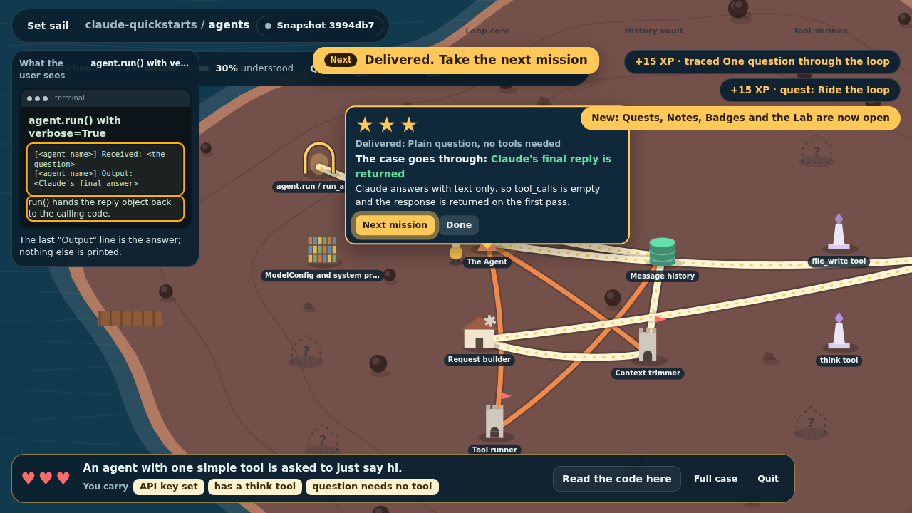

<h1 align="center">CodeQuest</h1>
<p align="center"><b>Turn any codebase into a game you play until you understand it.</b></p>

<p align="center">
  <a href="https://github.com/danielaranias/codequest/actions/workflows/ci.yml"></a>
  
  
  
</p>

<p align="center"></p>

Reading a new codebase is slow and you never know if you really got it. CodeQuest has your
coding agent map the repo into **worlds**, in the order the real system runs. Then you play:

- **Missions.** You are handed one real case. Carry it through the code and, at every fork,
  pick the road the code would really take. Three hearts. Up to three stars.
- **Worlds unlock in order.** Clear a world and the next one comes out of the fog.
- **See what the user sees.** A small screen beside the map shows the UI at each step.
- **The lab.** Inject your own case, change a flow and watch what breaks, or run the change
  for real against your tests in a throwaway branch.
- **Ask and challenge.** Every building is pinned to real lines. Ask about it, or claim it is
  wrong and let the agent check.
- **It stays honest.** When code changes, that part of the map goes under fog until it is re-mapped.

| The journey | A fork | Delivered |
|---|---|---|
|  |  |  |

## Install

Needs Node.js 18+ and git. No dependencies, no build step, no account.

**Claude Code**

```
/plugin marketplace add danielaranias/codequest
/plugin install codequest@codequest
```

**Codex, Cursor and other agents** (Agent Skills)

```
npx skills add danielaranias/codequest
```

**Just the CLI**

```
npx -y github:danielaranias/codequest doctor
```

## Play

In any repo, tell your agent: *"map this repo into CodeQuest"*, then *"play CodeQuest"*.
In Claude Code these are commands:

```
/codequest:map      the agent maps the code into worlds (.codequest/)
/codequest:play     opens the game in your browser
/codequest:sync     is the map still right? re-map only what changed
/codequest:export   one shareable HTML snapshot
```

Controls: arrows/WASD or click · **E** land / look · **1–9** or walk into a signpost to choose a road ·
**Space** continue · **Q** quests · **N** notes & tasks · **M** back to sea · **Esc** quit a mission.

**Try it now, no install:** open [`examples/claude-quickstarts/codequest.html`](examples/claude-quickstarts/codequest.html)
in a browser. It is a snapshot of [anthropics/claude-quickstarts](https://github.com/anthropics/claude-quickstarts).

Commit `.codequest/meta.json` and `.codequest/worlds/` so your team plays the same map.

## What it costs

CodeQuest is free and has no server. Mapping a repo and the AI features (ask, challenge,
simulate, tasks) use your own Claude Code or Codex plan. Walking, missions, quests and
snapshots use no AI at all.

## Private and safe by design

- Runs on 127.0.0.1 behind a one-time key. No telemetry.
- A repo you play is treated as **untrusted**: it cannot choose what runs on your machine, and
  the AI gets read-only tools scoped to that repo with no shell and no network.
- Changes happen in a throwaway git worktree on a `codequest/task-*` branch. Nothing is pushed.
- An exported snapshot contains code snippets. Share it only with people who may read that code.

The full list, each line backed by a test: [SECURITY.md](SECURITY.md).

## Settings

Yours, never the repo's: `codequest play --agent claude|codex --model <id> --test "npm test" --player ann`,
or once in `~/.config/codequest/config.json`:

```json
{ "agent": { "kind": "claude" }, "repos": { "/abs/path/to/repo": { "testCommand": "npm test" } } }
```

## Status

Version 1.0. Tried so far on two codebases with Claude Code on Linux and macOS. The Codex
adapter and Windows are experimental. Issues with "the mapper got this wrong" are the most useful ones.

## Contributing

Small on purpose: about 4,500 lines, readable in an evening. Start with [CONTRIBUTING.md](CONTRIBUTING.md).
How it works: [SPEC.md](SPEC.md) · Map format: [schema/WORLD_FORMAT.md](schema/WORLD_FORMAT.md)

## Licence

Free to use, change and share, at home and at work. **Selling it needs a commercial licence** —
see [COMMERCIAL.md](COMMERCIAL.md). Legal text: [LICENSE](LICENSE) (Apache 2.0 + Commons Clause).
