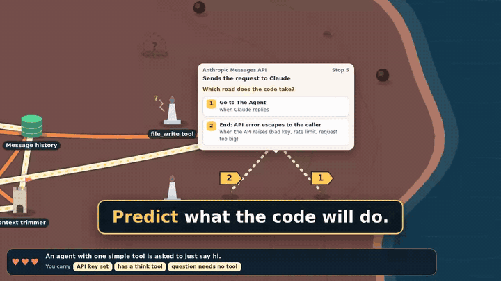
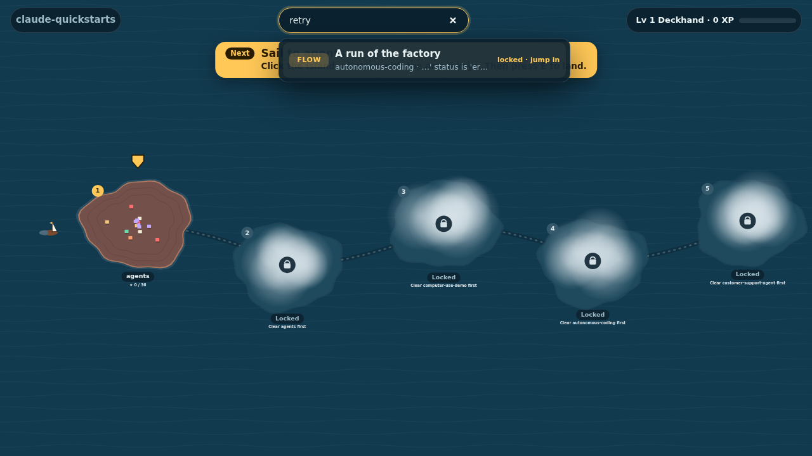
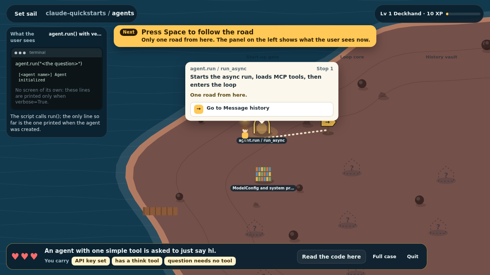
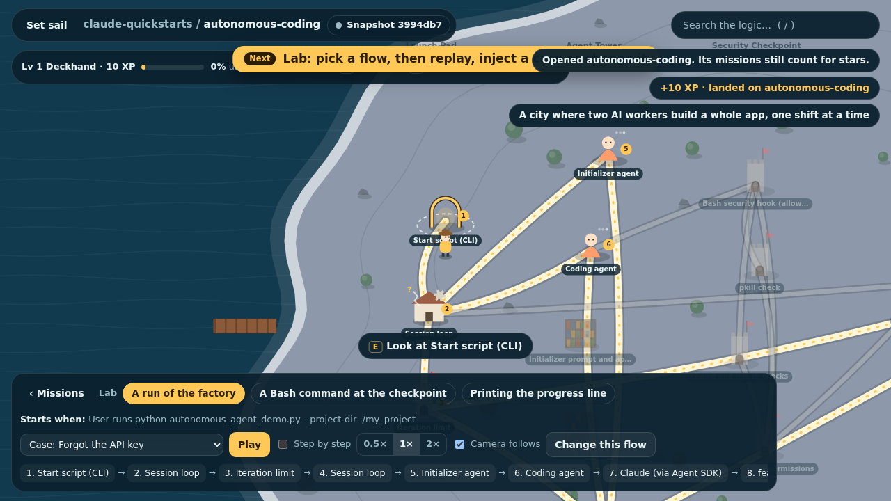

<h1 align="center">CodeQuest</h1>
<p align="center"><b>The AI keeps guessing. Take back control of your codebase — by playing it.</b></p>

<p align="center">
  <a href="https://github.com/danielaranias/codequest/actions/workflows/ci.yml"></a>
  
  
  
  
</p>

https://github.com/user-attachments/assets/a59ae398-01f0-4af4-a3f2-8571e974e761

<p align="center"></p>

You asked the AI to fix it. It said "Fixed!". It is still broken. You explained again. "You're
absolutely right — fixed now!" Still broken.

At that point you want to take control. But the codebase the AI wrote is overwhelming.

**CodeQuest turns your codebase into a game, so you can understand it and take back control.**
Your coding agent maps the repo into worlds, in the order the real system runs. Then:

- **Go straight to what is broken.** Press `/` and describe what goes wrong in your own words
  ("the chart does not show after I upload a file"). Your own agent finds the logic behind it,
  tells you why, and you jump in. No unlocking first. Plain word search works too, even offline.
- **See how it really runs.** Follow one real case through the code. At every fork, predict the
  road the code takes. Wrong? You see the exact condition you missed.
- **Drop in the case that fails.** In the lab, inject your own case or change a flow and watch what breaks.
- **Tell the AI exactly what to fix.** Claim something is wrong; the agent checks it against the real
  code, and a confirmed claim becomes a ready-made task on a separate branch.
- **See what the user sees.** A small screen beside the map shows the UI at each step.
- **It stays honest.** Every building is pinned to real lines. Code changed? That part goes under fog.

Not in a hurry? Play it as a journey: clear a world, and the next one comes out of the fog.

| Search and jump in | Predict the road | Straight to the lab |
|---|---|---|
|  |  |  |

## Install

Needs Node.js 18+ and git. No dependencies, no build step, no account.

**Claude Code**

```
/plugin marketplace add danielaranias/codequest
/plugin install codequest@codequest
```

**Codex, Cursor and other agents** (Agent Skills)

```
npx skills add danielaranias/codequest
```

**Just the CLI**

```
npx -y github:danielaranias/codequest doctor
```

## Play

In any repo, tell your agent: *"map this repo into CodeQuest"*, then *"play CodeQuest"*.
On the first screen pick **Start the journey**, or **Something is broken — find it** to search and jump in.
In Claude Code these are commands:

```
/codequest:map      the agent maps the code into worlds (.codequest/)
/codequest:play     opens the game in your browser
/codequest:sync     is the map still right? re-map only what changed
/codequest:export   one shareable HTML snapshot
```

Controls: **/** search and jump · arrows/WASD or click · **E** land / look · **1–9** or walk into a signpost to choose a road ·
**Space** continue · **Q** quests · **N** notes & tasks · **M** back to sea · **Esc** quit a mission.

**Try it now, no install:** open [`examples/claude-quickstarts/codequest.html`](examples/claude-quickstarts/codequest.html)
in a browser. It is a snapshot of [anthropics/claude-quickstarts](https://github.com/anthropics/claude-quickstarts).

Commit `.codequest/meta.json` and `.codequest/worlds/` so your team plays the same map.

## What it costs

CodeQuest is free and has no server. Mapping a repo and the AI features (search by meaning, ask,
challenge, simulate, tasks) use your own Claude Code or Codex plan. Walking, missions, quests and
snapshots use no AI at all.

One measured run, as a rough guide: mapping a 75-file library with Claude Code took about 4 minutes
and about $3 at API prices, and gave 6 worlds and 72 missions. A search by meaning takes about 5 seconds.

## Private and safe by design

- Runs on 127.0.0.1 behind a one-time key. No telemetry.
- A repo you play is treated as **untrusted**: it cannot choose what runs on your machine, and
  the AI gets read-only tools scoped to that repo with no shell and no network.
- Changes happen in a throwaway git worktree on a `codequest/task-*` branch. Nothing is pushed.
- An exported snapshot contains code snippets. Share it only with people who may read that code.

The full list, each line backed by a test: [SECURITY.md](SECURITY.md).

## Settings

Yours, never the repo's: `codequest play --agent claude|codex --model <id> --test "npm test" --player ann`,
or once in `~/.config/codequest/config.json`:

```json
{ "agent": { "kind": "claude" }, "repos": { "/abs/path/to/repo": { "testCommand": "npm test" } } }
```

## Status

Version 1.2. Tried so far on three codebases with Claude Code on Linux and macOS. The Codex
adapter and Windows are experimental. Issues with "the mapper got this wrong" are the most useful ones.

## Contributing

Small on purpose: about 4,500 lines, readable in an evening. Start with [CONTRIBUTING.md](CONTRIBUTING.md).
How it works: [SPEC.md](SPEC.md) · Map format: [schema/WORLD_FORMAT.md](schema/WORLD_FORMAT.md)

## Licence

[MIT](LICENSE). Use it, change it, ship it.
